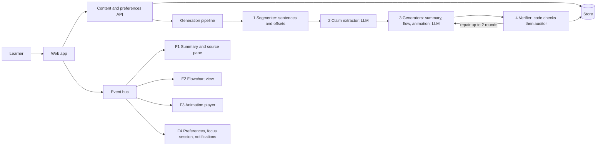

# StudyShift: agent implementation spec

## 0. Instructions for the implementing agent (read first)

You will be given ONE assignment by the orchestrator:

```
ASSIGNED_FEATURE: F1 | F2 | F3 | F4
ASSIGNED_TRACK:   UI | GEN | BACKEND | BOTH      (optional; default BOTH)
```

If `ASSIGNED_FEATURE` is missing, stop and ask. Everything else in this document is context so you understand how your piece fits.

**Reading order:** section 1 (product), 2 (architecture), 3 (contracts), 4 (verification rules), then your feature in section 5, then section 7 (handoff).

**Rules**

| ID | Rule |
|---|---|
| A-01 | Implement only your assigned feature and track. Other features are context. Do not build them. |
| A-02 | Edit only your feature's directories (section 2.5). Never edit `packages/contracts`, `packages/ui-tokens` or another feature. |
| A-03 | Contracts in section 3 are read-only. If you need a change, output a `CONTRACT_CHANGE_REQUEST` (section 7.2) and continue with the current contract. |
| A-04 | Develop against the fixtures in `fixtures/iam-01/`. Your work MUST run with no LLM key and no backend beyond the mock API. |
| A-05 | Never invent source facts. Every generated statement cites claim ids. Every anchor is a verbatim quote. |
| A-06 | Render model-generated text as text nodes only. No `innerHTML`, no `dangerouslySetInnerHTML`, no string-built HTML. |
| A-07 | Meet the accessibility baseline (section 2.8) for every UI you build. |
| A-08 | If a requirement is ambiguous, choose the simplest reading that satisfies every MUST, and record it under `assumptions` in your report. |
| A-09 | Finish with a `CompletionReport` (section 7.1) and passing tests. |

Requirement levels follow RFC 2119 (MUST, SHOULD, MAY).

## 1. Product overview

StudyShift turns a textbook passage or technical document into study material shaped for the learner, especially learners with ADHD or dyslexia. The passage is the source of truth. Everything the learner sees traces back to exact words in that passage.

**Principles**

| ID | Principle | Consequence for you |
|---|---|---|
| P1 | Provenance | Every generated item cites claim ids. Every claim points to a verbatim quote and offsets. |
| P2 | Content is separate from presentation | Generators produce structured data (no coordinates, no styling). Renderers decide how it looks. |
| P3 | The learner is in control | Nothing autoplays. Nothing forces pace. Motion, sound and density are learner settings. |
| P4 | Calm by default | No urgency cues, no countdown pressure, no surprise sounds. |
| P5 | Honesty | Learning aids (examples, analogies) are labelled as not from the source. Unverified output is labelled. |

**Assignable features**

| ID | Feature | One line |
|---|---|---|
| F1 | Summary, examples and pointers | A short summary plus examples. A "pointers" view lists key points, each with a small summary and a "See original text" button that highlights the exact phrase in the source. |
| F2 | Flowcharts | Processes and decision logic drawn as a flowchart from a verified graph, with a text alternative. |
| F3 | Animations | Learner-controlled, step-by-step animation of a flowchart scenario, with captions linked to the source. Also owns the motion policy. |
| F4 | Account preferences | Choose Regular or Focus. Focus bundles a hidden Pomodoro timer, rain sound and in-app Do Not Disturb. Also holds learning supports and display settings. |

**Context-only (do not build)**

| ID | Feature | Hook you may need to know about |
|---|---|---|
| G1 | Flashcards with re-quizzing of missed cards | Each card has an anchor and uses the `anchor.reveal` event. |
| G2 | Adaptive study guide formats (checklist, quest) | Reads preferences from F4. |
| G3 | Feedback adapter ("not working" changes the profile) | Writes to preferences through the same API as F4. |
| G4 | Human review screen (source next to output, verdict per item) | Reads `verification` blocks. |
| G5 | Add material (paste text or PDF) | Produces the `Source` object. |

## 2. Architecture

### 2.1 Overview



### 2.2 Components

| Component | Runs | Responsibility | Owner |
|---|---|---|---|
| Segmenter | backend, deterministic | Split text into sentences with ids and UTF-16 offsets | FOUNDATION |
| Claim extractor | backend, LLM | Atomic claims, each anchored to a verbatim quote | FOUNDATION |
| Summary generator | backend, LLM | Summary, pointers, examples | F1 GEN |
| Flow generator | backend, LLM | FlowGraph | F2 GEN |
| Animation scripter | backend, LLM | AnimationScript from a FlowGraph | F3 GEN |
| Verifier | backend, code plus LLM auditor | Enforce invariants (section 4). Repair loop. | FOUNDATION (checks per feature by each GEN track) |
| Content API | backend | Serve verified artifacts | FOUNDATION |
| Preferences API | backend | Store and serve user preferences | F4 BACKEND |
| Event bus | frontend | Typed events between features | FOUNDATION |
| SourcePane, SummaryPanel | frontend | Source text with highlights, summary and pointers | F1 UI |
| FlowchartView | frontend | Render a FlowGraph | F2 UI |
| AnimationPlayer, motion policy hook | frontend | Play a script over a flowchart | F3 UI |
| PreferencesPage, FocusSessionProvider, NotificationService | frontend | Settings, Pomodoro, rain, DND | F4 UI |

### 2.3 Data flow

1. Ingest: `POST /api/passages` with text. Segmenter creates `Source`.
2. Claims: extractor creates `ClaimList`. Each claim has an anchor whose quote MUST be a verbatim substring (checked in code).
3. Generators create `SummaryBundle`, `FlowGraph`, `AnimationScript`. Each cites claim ids.
4. Verifier runs code checks, then an LLM auditor, then marks `verification.status`. Failures go back to the generator with the complaints, up to 2 repair rounds. If errors remain the status is `failed` or `needs_human`.
5. The web app fetches artifacts, renders them, and coordinates through the event bus.

### 2.4 Reference stack (assumption A2)

Used unless the orchestrator overrides it. Contracts are language-neutral, so a different stack is fine if the contracts hold.

| Layer | Default |
|---|---|
| Frontend | TypeScript, React, Vite, CSS variables (no CSS-in-JS runtime) |
| Backend | Python 3.11, FastAPI, Pydantic models generated from the JSON Schema |
| LLM | Any OpenAI-compatible endpoint via env `LLM_BASE_URL`, `LLM_API_KEY`, `LLM_MODEL` |
| Storage | SQLite for users and preferences. Artifacts as JSON rows or files. |
| Tests | Vitest and Testing Library (UI), pytest (backend), Playwright and axe (end to end and accessibility) |
| Auth | Stubbed in FOUNDATION as `useUser()` returning a fixed user id (assumption A3) |

### 2.5 Repository layout and ownership

```
packages/contracts/        schemas, generated TS types, fixtures      (read-only for features)
packages/ui-tokens/        themes, motion tokens, motion policy hook  (read-only for features)
apps/web/src/shared/       event bus, API client with mock mode, a11y helpers, user stub (read-only)
apps/web/src/features/summary/      F1 UI
apps/web/src/features/flowchart/    F2 UI
apps/web/src/features/animation/    F3 UI
apps/web/src/features/preferences/  F4 UI (settings page, focus session, notifications)
apps/api/app/pipeline/              segmenter, claims, verifier            (FOUNDATION)
apps/api/app/generators/summary/    F1 GEN
apps/api/app/generators/flow/       F2 GEN
apps/api/app/generators/animation/  F3 GEN
apps/api/app/preferences/           F4 BACKEND
fixtures/iam-01/                    shared fixture
tools/                              validate_bundle.py, test_validator.py
```

### 2.6 Phase 0: FOUNDATION (done before feature agents start)

The orchestrator or a dedicated agent MUST provide: repo scaffold and CI; `packages/contracts` (this schema, generated types, fixtures); `packages/ui-tokens` (section 2.7); event bus; API client with a mock mode that serves `fixtures/iam-01`; a stub `SourcePane` handler that logs `anchor.reveal`; a `NotificationService` that shows plain toasts; `useMotionPolicy()`; `useUser()`; an app shell with one empty slot per feature. Feature agents can then work in parallel.

### 2.7 Design tokens and motion

Two themes on `:root[data-mode]`. Text pairs were checked against WCAG 2.2 (`--ink` and `--muted` on `--bg` and `--surface`, `--brand-ink` on `--brand`, `--ink` on both mark colors) and all meet 4.5:1. `--accent` is for fills only, never for text.

| Token | regular | focus |
|---|---|---|
| `--bg` | #F2F7F7 | #0B1B1E |
| `--surface` | #FFFFFF | #122A2E |
| `--ink` | #12292C | #E3EFED |
| `--muted` | #4A5E61 | #9DB8B5 |
| `--line` | #C7D9D6 | #264247 |
| `--brand` | #1B7A75 | #58C6BD |
| `--brand-ink` | #FFFFFF | #062321 |
| `--mark` (linked phrase) | #FFE29A | #4E4116 |
| `--mark-active` | #FFC857 | #7D5C0C |
| `--accent` | #F4A62A | #F4A62A |

Typography: Lexend, fallback `system-ui, Verdana, sans-serif`. Dyslexia typography adds `letter-spacing: 0.03em`, `word-spacing: 0.1em`, `line-height: 1.85`. Text is always left aligned. Base size scales with `display.text_scale`.

Motion tokens: `--motion-fast: 120ms`, `--motion-base: 200ms`, `--motion-slow: 320ms`, `--ease: cubic-bezier(.2,.7,.2,1)`.

**Motion policy.** `useMotionPolicy()` returns `"full" | "reduced" | "off"`. Effective value is the lower of the user's `display.motion` and the OS setting (`prefers-reduced-motion: reduce` caps at `reduced`). Order: full > reduced > off. Every animated thing in the product MUST consult it.

### 2.8 Cross-cutting requirements

| ID | Requirement |
|---|---|
| X-01 | WCAG 2.2 AA. Every control is a real `button`, `a` or `input` with a visible label or `aria-label`. Visible focus ring. Target size at least 44 by 44 CSS px on touch. |
| X-02 | Never rely on color alone. Pair color with text, shape or icon. |
| X-03 | No flashing above 3 flashes per second. |
| X-04 | Keyboard operable end to end. No keyboard traps. Dialogs trap focus and return it on close. |
| X-05 | Loading, empty and error states exist for every fetch. Errors say what happened and how to retry. |
| X-06 | No remote assets except optionally a web font. No third-party scripts. |
| X-07 | Treat `supports.adhd` and `supports.dyslexia` as sensitive. Do not log them, send them to analytics, or include them in error reports. |
| X-08 | Offsets are UTF-16 code units, matching JavaScript `String.slice`. Python code MUST convert. Text is NFC with `\n` line endings and is immutable after ingestion. |

## 3. Contracts

Conventions: ids are prefix plus number (`S` sentence, `C` claim, `M` summary sentence, `P` pointer, `X` example, `N` node, `E` edge, `A` animation step). `Anchor.start` and `Anchor.end` are offsets into `Source.text` (end exclusive). `Anchor.quote` MUST equal `Source.text.slice(start, end)` and MUST lie inside its sentence.

### 3.1 JSON Schema (draft 2020-12)

Also shipped as `schemas/studyshift.schema.json`. Validate a payload against `#/$defs/<TypeName>`.

```json
{
  "$schema": "https://json-schema.org/draft/2020-12/schema",
  "$id": "https://studyshift.example/schema/v1.json",
  "title": "StudyShift contracts v1",
  "$defs": {
    "SentenceId": {"type": "string", "pattern": "^S[0-9]+$"},
    "ClaimId": {"type": "string", "pattern": "^C[0-9]+$"},
    "SummaryId": {"type": "string", "pattern": "^M[0-9]+$"},
    "PointerId": {"type": "string", "pattern": "^P[0-9]+$"},
    "ExampleId": {"type": "string", "pattern": "^X[0-9]+$"},
    "NodeId": {"type": "string", "pattern": "^N[0-9]+$"},
    "EdgeId": {"type": "string", "pattern": "^E[0-9]+$"},
    "StepId": {"type": "string", "pattern": "^A[0-9]+$"},
    "Anchor": {
      "type": "object",
      "properties": {
        "sentence_id": {"$ref": "#/$defs/SentenceId"},
        "start": {"type": "integer", "minimum": 0},
        "end": {"type": "integer", "minimum": 1},
        "quote": {"type": "string", "minLength": 1, "maxLength": 400}
      },
      "required": ["sentence_id", "start", "end", "quote"],
      "additionalProperties": false
    },
    "Sentence": {
      "type": "object",
      "properties": {
        "id": {"$ref": "#/$defs/SentenceId"},
        "start": {"type": "integer", "minimum": 0},
        "end": {"type": "integer", "minimum": 1},
        "text": {"type": "string", "minLength": 1}
      },
      "required": ["id", "start", "end", "text"],
      "additionalProperties": false
    },
    "Source": {
      "type": "object",
      "properties": {
        "schema_version": {"const": "1.0"},
        "passage_id": {"type": "string", "minLength": 1},
        "title": {"type": "string", "minLength": 1},
        "language": {"type": "string", "pattern": "^[a-z]{2}(-[A-Z]{2})?$"},
        "text": {"type": "string", "minLength": 1},
        "sentences": {"type": "array", "items": {"$ref": "#/$defs/Sentence"}, "minItems": 1}
      },
      "required": ["schema_version", "passage_id", "title", "language", "text", "sentences"],
      "additionalProperties": false
    },
    "Claim": {
      "type": "object",
      "properties": {
        "id": {"$ref": "#/$defs/ClaimId"},
        "text": {"type": "string", "minLength": 1},
        "sentence_ids": {"type": "array", "items": {"$ref": "#/$defs/SentenceId"}, "minItems": 1},
        "anchor": {"$ref": "#/$defs/Anchor"},
        "must_keep": {"type": "array", "items": {"type": "string", "minLength": 1}}
      },
      "required": ["id", "text", "sentence_ids", "anchor", "must_keep"],
      "additionalProperties": false
    },
    "ClaimList": {
      "type": "object",
      "properties": {
        "schema_version": {"const": "1.0"},
        "passage_id": {"type": "string", "minLength": 1},
        "claims": {"type": "array", "items": {"$ref": "#/$defs/Claim"}, "minItems": 1}
      },
      "required": ["schema_version", "passage_id", "claims"],
      "additionalProperties": false
    },
    "Check": {
      "type": "object",
      "properties": {
        "name": {"type": "string"},
        "layer": {"enum": ["code", "auditor", "human"]},
        "status": {"enum": ["pass", "warn", "fail"]},
        "detail": {"type": "string"}
      },
      "required": ["name", "layer", "status", "detail"],
      "additionalProperties": false
    },
    "VerificationReport": {
      "type": "object",
      "properties": {
        "status": {"enum": ["passed", "failed", "needs_human"]},
        "checks": {"type": "array", "items": {"$ref": "#/$defs/Check"}}
      },
      "required": ["status", "checks"],
      "additionalProperties": false
    },
    "SummarySentence": {
      "type": "object",
      "properties": {
        "id": {"$ref": "#/$defs/SummaryId"},
        "text": {"type": "string", "minLength": 1},
        "claim_ids": {"type": "array", "items": {"$ref": "#/$defs/ClaimId"}, "minItems": 1},
        "pointer_ids": {"type": "array", "items": {"$ref": "#/$defs/PointerId"}}
      },
      "required": ["id", "text", "claim_ids", "pointer_ids"],
      "additionalProperties": false
    },
    "Pointer": {
      "type": "object",
      "properties": {
        "id": {"$ref": "#/$defs/PointerId"},
        "order": {"type": "integer", "minimum": 1},
        "title": {"type": "string", "minLength": 1, "maxLength": 80},
        "summary": {"type": "string", "minLength": 1, "maxLength": 400},
        "anchor": {"$ref": "#/$defs/Anchor"},
        "claim_ids": {"type": "array", "items": {"$ref": "#/$defs/ClaimId"}, "minItems": 1}
      },
      "required": ["id", "order", "title", "summary", "anchor", "claim_ids"],
      "additionalProperties": false
    },
    "Example": {
      "type": "object",
      "properties": {
        "id": {"$ref": "#/$defs/ExampleId"},
        "kind": {"enum": ["analogy", "worked_example", "scenario"]},
        "title": {"type": "string", "minLength": 1, "maxLength": 80},
        "body": {"type": "string", "minLength": 1, "maxLength": 600},
        "related_pointer_ids": {"type": "array", "items": {"$ref": "#/$defs/PointerId"}},
        "claim_ids": {"type": "array", "items": {"$ref": "#/$defs/ClaimId"}, "minItems": 1},
        "is_source_content": {"const": false},
        "derived_numbers": {"type": "array", "items": {"type": "string"}}
      },
      "required": [
        "id",
        "kind",
        "title",
        "body",
        "related_pointer_ids",
        "claim_ids",
        "is_source_content",
        "derived_numbers"
      ],
      "additionalProperties": false
    },
    "SummaryBundle": {
      "type": "object",
      "properties": {
        "schema_version": {"const": "1.0"},
        "passage_id": {"type": "string", "minLength": 1},
        "summary": {"type": "array", "items": {"$ref": "#/$defs/SummarySentence"}, "minItems": 1},
        "pointers": {"type": "array", "items": {"$ref": "#/$defs/Pointer"}, "minItems": 1},
        "examples": {"type": "array", "items": {"$ref": "#/$defs/Example"}},
        "verification": {"$ref": "#/$defs/VerificationReport"}
      },
      "required": ["schema_version", "passage_id", "summary", "pointers", "examples", "verification"],
      "additionalProperties": false
    },
    "FlowNode": {
      "type": "object",
      "properties": {
        "id": {"$ref": "#/$defs/NodeId"},
        "kind": {"enum": ["terminal_start", "terminal_end", "process", "decision", "note"]},
        "label": {"type": "string", "minLength": 1, "maxLength": 100},
        "detail": {"type": "string", "maxLength": 300},
        "tone": {"enum": ["neutral", "positive", "negative"]},
        "claim_ids": {"type": "array", "items": {"$ref": "#/$defs/ClaimId"}, "minItems": 1},
        "anchor": {"$ref": "#/$defs/Anchor"}
      },
      "required": ["id", "kind", "label", "tone", "claim_ids"],
      "additionalProperties": false
    },
    "FlowEdge": {
      "type": "object",
      "properties": {
        "id": {"$ref": "#/$defs/EdgeId"},
        "from": {"$ref": "#/$defs/NodeId"},
        "to": {"$ref": "#/$defs/NodeId"},
        "label": {"type": "string", "maxLength": 40},
        "claim_ids": {"type": "array", "items": {"$ref": "#/$defs/ClaimId"}, "minItems": 1},
        "basis": {"enum": ["stated", "implied"]},
        "rationale": {"type": "string", "maxLength": 300}
      },
      "required": ["id", "from", "to", "claim_ids", "basis"],
      "additionalProperties": false
    },
    "FlowGraph": {
      "type": "object",
      "properties": {
        "schema_version": {"const": "1.0"},
        "passage_id": {"type": "string", "minLength": 1},
        "title": {"type": "string", "minLength": 1},
        "nodes": {"type": "array", "items": {"$ref": "#/$defs/FlowNode"}, "minItems": 2},
        "edges": {"type": "array", "items": {"$ref": "#/$defs/FlowEdge"}, "minItems": 1},
        "verification": {"$ref": "#/$defs/VerificationReport"}
      },
      "required": ["schema_version", "passage_id", "title", "nodes", "edges", "verification"],
      "additionalProperties": false
    },
    "AnimationStep": {
      "type": "object",
      "properties": {
        "id": {"$ref": "#/$defs/StepId"},
        "order": {"type": "integer", "minimum": 1},
        "focus_node_ids": {"type": "array", "items": {"$ref": "#/$defs/NodeId"}},
        "focus_edge_ids": {"type": "array", "items": {"$ref": "#/$defs/EdgeId"}},
        "caption": {"type": "string", "minLength": 1, "maxLength": 200},
        "claim_ids": {"type": "array", "items": {"$ref": "#/$defs/ClaimId"}, "minItems": 1},
        "anchor": {"$ref": "#/$defs/Anchor"},
        "suggested_duration_ms": {"type": "integer", "minimum": 800, "maximum": 10000},
        "hypothetical": {"type": "boolean"}
      },
      "required": [
        "id",
        "order",
        "focus_node_ids",
        "focus_edge_ids",
        "caption",
        "claim_ids",
        "suggested_duration_ms",
        "hypothetical"
      ],
      "additionalProperties": false
    },
    "AnimationScript": {
      "type": "object",
      "properties": {
        "schema_version": {"const": "1.0"},
        "passage_id": {"type": "string", "minLength": 1},
        "kind": {"enum": ["walkthrough", "scenario"]},
        "title": {"type": "string", "minLength": 1},
        "scenario_premise": {"type": "string", "maxLength": 300},
        "path_edge_ids": {"type": "array", "items": {"$ref": "#/$defs/EdgeId"}},
        "steps": {"type": "array", "items": {"$ref": "#/$defs/AnimationStep"}, "minItems": 1},
        "verification": {"$ref": "#/$defs/VerificationReport"}
      },
      "required": ["schema_version", "passage_id", "kind", "title", "path_edge_ids", "steps", "verification"],
      "additionalProperties": false
    },
    "UserPreferences": {
      "type": "object",
      "properties": {
        "schema_version": {"const": "1.0"},
        "mode": {"enum": ["regular", "focus"]},
        "supports": {
          "type": "object",
          "properties": {"adhd": {"type": "boolean"}, "dyslexia": {"type": "boolean"}},
          "required": ["adhd", "dyslexia"],
          "additionalProperties": false
        },
        "display": {
          "type": "object",
          "properties": {
            "text_scale": {"type": "number", "minimum": 0.9, "maximum": 1.6},
            "motion": {"enum": ["full", "reduced", "off"]},
            "line_focus": {"type": "boolean"},
            "dyslexia_typography": {"type": "boolean"}
          },
          "required": ["text_scale", "motion", "line_focus", "dyslexia_typography"],
          "additionalProperties": false
        },
        "focus": {
          "type": "object",
          "properties": {
            "pomodoro": {
              "type": "object",
              "properties": {
                "enabled": {"type": "boolean"},
                "visible": {"type": "boolean"},
                "allow_peek": {"type": "boolean"},
                "work_minutes": {"type": "integer", "minimum": 5, "maximum": 90},
                "break_minutes": {"type": "integer", "minimum": 1, "maximum": 30},
                "nudge": {"enum": ["chime", "visual", "both", "none"]}
              },
              "required": ["enabled", "visible", "allow_peek", "work_minutes", "break_minutes", "nudge"],
              "additionalProperties": false
            },
            "rain": {
              "type": "object",
              "properties": {
                "enabled": {"type": "boolean"},
                "volume": {"type": "number", "minimum": 0, "maximum": 1},
                "during_break": {"enum": ["continue", "pause"]}
              },
              "required": ["enabled", "volume", "during_break"],
              "additionalProperties": false
            },
            "dnd": {
              "type": "object",
              "properties": {
                "enabled": {"type": "boolean"},
                "hold_in_app_notifications": {"type": "boolean"},
                "digest_on_end": {"type": "boolean"}
              },
              "required": ["enabled", "hold_in_app_notifications", "digest_on_end"],
              "additionalProperties": false
            }
          },
          "required": ["pomodoro", "rain", "dnd"],
          "additionalProperties": false
        },
        "storage": {
          "type": "object",
          "properties": {"sync": {"enum": ["account", "device_only"]}},
          "required": ["sync"],
          "additionalProperties": false
        },
        "updated_at": {"type": "string", "format": "date-time"}
      },
      "required": ["schema_version", "mode", "supports", "display", "focus", "storage", "updated_at"],
      "additionalProperties": false
    },
    "NotificationItem": {
      "type": "object",
      "properties": {
        "id": {"type": "string", "minLength": 1},
        "created_at": {"type": "string", "format": "date-time"},
        "category": {"enum": ["study", "social", "reminder", "system", "security"]},
        "title": {"type": "string", "minLength": 1},
        "body": {"type": "string"}
      },
      "required": ["id", "created_at", "category", "title", "body"],
      "additionalProperties": false
    },
    "FocusSessionState": {
      "type": "object",
      "properties": {
        "state": {"enum": ["idle", "work", "break", "ended"]},
        "started_at": {"type": "string", "format": "date-time"},
        "phase_started_at": {"type": "string", "format": "date-time"},
        "phase_ends_at": {"type": "string", "format": "date-time"},
        "cycles_completed": {"type": "integer", "minimum": 0},
        "rain_running": {"type": "boolean"},
        "dnd_active": {"type": "boolean"},
        "queued_notifications": {"type": "array", "items": {"$ref": "#/$defs/NotificationItem"}}
      },
      "required": ["state", "cycles_completed", "rain_running", "dnd_active", "queued_notifications"],
      "additionalProperties": false
    },
    "EventEnvelope": {
      "type": "object",
      "properties": {
        "type": {
          "enum": [
            "anchor.reveal",
            "pointer.activated",
            "flow.node.selected",
            "animation.step.changed",
            "prefs.changed",
            "focus.session.started",
            "focus.session.phase_changed",
            "focus.session.ended",
            "notification.suppressed",
            "contract.violation"
          ]
        },
        "at": {"type": "string", "format": "date-time"},
        "payload": {"type": "object"}
      },
      "required": ["type", "at", "payload"],
      "additionalProperties": false
    },
    "CompletionReport": {
      "type": "object",
      "properties": {
        "feature_id": {"enum": ["F1", "F2", "F3", "F4"]},
        "track": {"enum": ["UI", "GEN", "BACKEND", "BOTH"]},
        "status": {"enum": ["complete", "partial", "blocked"]},
        "files_changed": {"type": "array", "items": {"type": "string"}},
        "requirements": {
          "type": "array",
          "items": {
            "type": "object",
            "properties": {
              "id": {"type": "string", "pattern": "^F[1-4]-[RG][0-9]{2}$"},
              "status": {"enum": ["met", "partial", "not_met"]},
              "evidence": {"type": "string"}
            },
            "required": ["id", "status", "evidence"],
            "additionalProperties": false
          }
        },
        "tests": {
          "type": "object",
          "properties": {"added": {"type": "integer", "minimum": 0}, "passing": {"type": "integer", "minimum": 0}},
          "required": ["added", "passing"],
          "additionalProperties": false
        },
        "contract_change_requests": {"type": "array", "items": {"type": "string"}},
        "assumptions": {"type": "array", "items": {"type": "string"}},
        "known_issues": {"type": "array", "items": {"type": "string"}}
      },
      "required": [
        "feature_id",
        "track",
        "status",
        "files_changed",
        "requirements",
        "tests",
        "contract_change_requests",
        "assumptions",
        "known_issues"
      ],
      "additionalProperties": false
    }
  }
}
```

### 3.2 API

| Method and path | Response | Notes |
|---|---|---|
| `POST /api/passages` | 202 `{passage_id, job_id}` | Body `{title, text}` |
| `GET /api/jobs/{job_id}` | `{status: queued|running|done|failed, stage, error?}` | Poll |
| `GET /api/passages/{id}/source` | `Source` | |
| `GET /api/passages/{id}/claims` | `ClaimList` | |
| `GET /api/passages/{id}/summary` | `SummaryBundle` | F1 |
| `GET /api/passages/{id}/flow` | `FlowGraph` | F2 |
| `GET /api/passages/{id}/animation` | `AnimationScript` | F3 |
| `GET /api/me/preferences` | `UserPreferences` | F4 |
| `PUT /api/me/preferences` | `UserPreferences` | Full replace. 422 with field errors on invalid input. |

Responses MUST validate against the schema. The web app runs a dev-only contract check on every response.

### 3.3 Event bus

Envelope: `EventEnvelope`. Features communicate only through these events and through the props below.

| Event `type` | Payload | Emitted by | Handled by |
|---|---|---|---|
| `anchor.reveal` | `{anchor: Anchor, origin: "pointer"|"summary_chip"|"flow_node"|"animation_step"|"flashcard"}` | F1, F2, F3, G1 | F1 SourcePane (scroll and highlight) |
| `pointer.activated` | `{pointer_id, via: "list"|"text"|"chip"}` | F1 | analytics-free listeners |
| `flow.node.selected` | `{node_id}` | F2 | F3, G4 |
| `animation.step.changed` | `{step_id, order, playing}` | F3 | F2 (via props), F1 |
| `prefs.changed` | `{changed_keys: string[]}` | F4 | all |
| `focus.session.started` / `focus.session.phase_changed` / `focus.session.ended` | `{state, cycles_completed}` | F4 | all |
| `notification.suppressed` | `{id, category}` | F4 | F4 digest |
| `contract.violation` | `{where, message}` | any | dev console |

### 3.4 Component interfaces (types only)

```ts
// F1
SummaryPanel(props: { passageId: string })
SourcePane(props: { passageId: string })            // owns highlight rendering; listens for anchor.reveal
// F2
FlowchartView(props: {
  graph: FlowGraph;
  highlight?: { nodeIds: string[]; edgeIds: string[] };   // set by F3, or by selection
  onNodeSelect?: (nodeId: string) => void;
})
// F3
AnimationPlayer(props: { graph: FlowGraph; script: AnimationScript })   // renders FlowchartView with highlight
// F4
PreferencesPage(props: {})
FocusSessionProvider(props: { children })                 // exposes useFocusSession()
useFocusSession(): { state: FocusSessionState; start(): void; end(): void; peek(): void; takeBreak(): void; keepGoing(): void }
NotificationService: { notify(n: NotificationItem): void }  // policy lives in F4
// shared (FOUNDATION)
usePreferences(): { prefs: UserPreferences; update(patch): Promise<void> }
useMotionPolicy(): "full" | "reduced" | "off"
```

## 4. Verification rules (shared)

Generators output data only. The verifier enforces these invariants in code. A reference implementation is `tools/validate_bundle.py`; extend it rather than rewriting it. `tools/test_validator.py` proves each rule fires.

| Code | Rule |
|---|---|
| V-ANCH-01 | `source.text[start:end] == quote` for every anchor |
| V-ANCH-02 | Anchor lies inside its sentence |
| V-ID-01, V-REF-01 | Ids are unique. Every referenced id exists. |
| V-F1-01 | Pointer anchors do not overlap |
| V-F1-02 | Pointer title at most 8 words, summary at most 40 words, anchor phrase 3 to 30 words |
| V-F1-03 | Summary sentence at most 30 words |
| V-F1-04 | Numbers in summary and pointer text appear in the cited claims |
| V-F1-05 | Numbers in examples that are not in cited claims MUST be listed in `derived_numbers` |
| V-F1-06 | 3 to 12 pointers |
| V-F2-01 | Exactly one `terminal_start`, at least one `terminal_end` |
| V-F2-02 | Every non-note node is reachable from the start |
| V-F2-03 | Decision nodes have 2 or more outgoing edges with unique non-empty labels |
| V-F2-04 | `process` and `terminal_start` have exactly one outgoing edge. `terminal_end` and `note` have none. |
| V-F2-05 | Edges reference existing nodes and are not self loops |
| V-F2-06 | `basis: implied` edges need a `rationale` and are routed to human review |
| V-F2-07 | Node label at most 12 words |
| V-F2-08 | No cycles in v1 |
| V-F2-09 | Numbers in node text appear in cited claims |
| V-F3-01 | `path_edge_ids` is a contiguous path from `terminal_start` to a `terminal_end` |
| V-F3-02 | Focus ids exist and focus edges lie on the path |
| V-F3-03 | Step orders are 1..n and steps never move backward along the path |
| V-F3-04, V-F3-05 | Caption at most 25 words. At most 12 steps. |
| V-F3-06 | Numbers in captions appear in cited claims |
| V-F3-07 | Scenario scripts have a `scenario_premise` and at least one `hypothetical` step |

**Statuses.** `passed`: no errors and no warnings needing a human. `needs_human`: no errors but at least one warning (for example an implied edge). `failed`: errors remain after 2 repair rounds. The UI MUST show a visible banner for anything other than `passed`.

## 5. Features

### F1. Summary, examples and pointers

**Story.** As a learner, I read a short summary and examples. I can switch to a list of pointers, open one to read its small summary, and press "See original text" to see the exact phrase highlighted in the source.

**Interface.** `SummaryPanel`, `SourcePane`. Data: `SummaryBundle`, `Source`. Emits `anchor.reveal`, `pointer.activated`. Handles `anchor.reveal` from any feature.

**UI requirements**

| ID | Level | Requirement |
|---|---|---|
| F1-R01 | MUST | The panel has two modes, "Summary" and "Pointers", switchable at any time. Default is Summary. |
| F1-R02 | MUST | Summary mode lists `summary` sentences in order. Each has a source button that highlights the anchors of its `pointer_ids`. |
| F1-R03 | MUST | Pointers mode lists pointers by `order`. Collapsed shows `title`. Expanded shows `summary` and a button labelled exactly "See original text". |
| F1-R04 | MUST | "See original text" scrolls the source pane so the anchor is visible, highlights only `[start, end)`, keeps the pointer expanded, and announces "Showing original text for <title>" in a polite live region. |
| F1-R05 | MUST | Highlighted phrases in the source are focusable buttons. Enter or Space activates the pointer (opens it in Pointers mode, or shows a non-modal peek with title and summary in Summary mode). Escape closes the peek. |
| F1-R06 | MUST | Highlights are built by splitting text at offsets and rendering text nodes (rule A-06). |
| F1-R07 | MUST | If an anchor fails V-ANCH-01 at runtime, skip that pointer, emit `contract.violation`, and continue. Overlapping anchors: the lower `order` wins, the other is skipped. |
| F1-R08 | MUST | Examples carry the visible text label "Example. Not from the source." They are expanded in regular mode and collapsed in focus mode. |
| F1-R09 | MUST | Examples with `related_pointer_ids` show link chips that activate those pointers. |
| F1-R10 | MUST | Pointer list uses the disclosure pattern (`button` with `aria-expanded` and `aria-controls`). Each highlighted phrase has an accessible name that includes the pointer title. |
| F1-R11 | MUST | Scroll and highlight transitions follow `useMotionPolicy()` (`smooth` only when `full`). |
| F1-R12 | MUST | In focus mode or when `display.line_focus` is true, paragraphs other than the one containing the active highlight or hover switch their text color to `--muted`. Dim with color, never with opacity, so text keeps at least 4.5:1 contrast. |
| F1-R13 | SHOULD | Numbered badges appear beside highlighted phrases in Pointers mode. |
| F1-R14 | MUST | Show the verification banner for non-`passed` status. Show loading, empty and error states. |

**GEN requirements**

| ID | Level | Requirement |
|---|---|---|
| F1-G01 | MUST | Produce 3 to 12 pointers spread across the passage. Each anchor is a verbatim phrase of 3 to 30 words inside one sentence. |
| F1-G02 | MUST | Every claim that contains a number appears in at least one pointer or summary sentence. |
| F1-G03 | MUST | Summary is 3 to 6 sentences, each citing claims and linking `pointer_ids`. |
| F1-G04 | MUST | Produce 1 to 3 examples. Set `is_source_content: false`. List every number not in cited claims in `derived_numbers`. |
| F1-G05 | MUST | Pass all V-F1 rules. Repair up to 2 rounds using verifier complaints. |
| F1-G06 | SHOULD | Use plain words. Keep technical terms and explain them in the pointer summary instead of replacing them. |

**Acceptance tests**

```gherkin
Scenario: See original text highlights the exact phrase
  Given the iam-01 fixture is loaded and Pointers mode is active
  When I expand pointer P4 and press "See original text"
  Then the source pane scrolls so the phrase "the final decision is deny, even when another policy allows it" is visible
  And exactly that phrase is highlighted and no other text is
  And the live region says "Showing original text for Deny beats allow"

Scenario: Clicking a phrase opens its pointer
  Given Pointers mode is active
  When I press Enter on the highlighted phrase for P2
  Then pointer P2 is expanded and marked active

Scenario: Corrupt anchor is skipped
  Given pointer P3 has a quote that does not match the source
  When the panel renders
  Then P3 is not shown
  And a contract.violation event is emitted
  And the other pointers still render

Scenario: Examples are labelled and follow the mode
  Given regular mode
  Then example X1 is expanded and shows "Example. Not from the source."
  When mode is focus
  Then example X1 is collapsed
```

### F2. Flowcharts

**Story.** As a learner, I see a process or decision logic as a diagram, can select any box to read its detail and jump to the original text, and can read the same thing as text.

**Interface.** `FlowchartView`. Data: `FlowGraph`. Emits `flow.node.selected`, `anchor.reveal`. Accepts `highlight` from F3.

**UI requirements**

| ID | Level | Requirement |
|---|---|---|
| F2-R01 | MUST | Render as SVG. The graph has no coordinates; compute layout on the client with a layout library (default dagre or ELK), top to bottom. |
| F2-R02 | MUST | Shapes by kind: pill for terminals, diamond for decision, rounded rectangle for process, dashed box for note. `tone` maps to theme tokens and is also conveyed by the label text. |
| F2-R03 | MUST | Edge labels render beside their edge. Arrowheads show direction. |
| F2-R04 | MUST | Selecting a node (click, Enter, Space) opens a detail panel with `detail`, the text of its cited claims and a "See original text" button that emits `anchor.reveal` for `anchor` (or the first cited claim's anchor). |
| F2-R05 | MUST | A "Text version" is always available: an ordered list generated from the graph, with branches phrased "If yes, go to <label>". The SVG has `role="img"` and an `aria-label` summary. |
| F2-R06 | MUST | Nodes are focusable in topological order. Tab moves through them. |
| F2-R07 | MUST | Nodes listed in `highlight` get a strong visible emphasis (outline plus weight, not color alone). Emphasis changes follow `useMotionPolicy()`. |
| F2-R08 | MUST | If layout throws or the graph is invalid, show the Text version and a plain message. Never a blank area. |
| F2-R09 | MUST | Fit to container width by default. Minimum rendered text size 14px at 100 percent. Support zoom and pan for large graphs. On narrow screens the chart scrolls horizontally inside a labelled region. |
| F2-R10 | MUST | Render labels as text nodes. Never pass ids or labels into any diagram-language syntax (reserved words such as `end` break some libraries). |
| F2-R11 | SHOULD | 60 nodes render in under 300 ms. |
| F2-R12 | MUST | Edges with `basis: implied` are drawn dashed and the Text version marks them "implied". |

**GEN requirements**

| ID | Level | Requirement |
|---|---|---|
| F2-G01 | MUST | Produce a FlowGraph that passes every V-F2 rule. |
| F2-G02 | MUST | Every edge cites claims that justify the transition. Use `basis: stated` when the source states it. Use `implied` only when the claims logically require it, with a `rationale`. Never draw an arrow the source does not support. |
| F2-G03 | MUST | Use only claim content. Labels have at most 12 words, plain and active. |
| F2-G04 | SHOULD | Use `note` nodes for facts that are not part of the flow (see N7 in the fixture). |
| F2-G05 | SHOULD | Respect a `max_nodes` limit passed in the request (derived from learner supports). Merge or drop lower-value nodes, never invent. |
| F2-G06 | MUST | Repair up to 2 rounds. |

**Acceptance tests**

```gherkin
Scenario: Decision branches are labelled
  Given the iam-01 flow
  Then node N2 has two outgoing edges labelled "yes" and "no"

Scenario: Text version matches the graph
  Given the iam-01 flow
  Then the Text version lists 7 items and item "Explicit deny in any policy?" contains "If yes, go to Denied" and "If no, go to Explicit allow in a policy?"

Scenario: Node detail reveals the source
  When I select node N4 and press "See original text"
  Then an anchor.reveal event is emitted with the anchor of N4

Scenario: Layout failure falls back
  Given the layout library throws
  Then the Text version is shown with a message and no exception reaches the console
```

### F3. Animations

Assumption A1: "Animations" means learner-controlled explanatory animation of a flowchart scenario (walk a request through the graph), plus ownership of the product motion policy. If a different meaning was intended, stop and ask.

**Story.** As a learner, I press Play (or Next) to watch one concrete scenario move through the flowchart, one caption at a time, with the matching source text one press away.

**Interface.** `AnimationPlayer` (renders `FlowchartView` with `highlight`). Data: `FlowGraph`, `AnimationScript`. Emits `animation.step.changed`, `anchor.reveal`. Consumes `useMotionPolicy()`.

**UI requirements**

| ID | Level | Requirement |
|---|---|---|
| F3-R01 | MUST | Controls: Play or Pause, Previous step, Next step, Restart, Speed (0.5x, 1x, 1.5x), and a keyboard-operable step scrubber showing "Step n of N". |
| F3-R02 | MUST | The player starts paused at step 1. It MUST NOT autoplay under any setting. |
| F3-R03 | MUST | Each step highlights `focus_node_ids` and `focus_edge_ids` through the `highlight` prop, shows `caption` below the chart, and offers "See original text" for the step `anchor`. |
| F3-R04 | MUST | Captions render in a polite live region. |
| F3-R05 | MUST | Motion by policy. `full`: a marker travels along the focused edge in at most 800 ms and the focused node pulses once for at most 600 ms. `reduced`: no travel or pulse, highlight changes instantly (or a fade of at most 150 ms). `off`: instant, and Play is replaced by Next only. |
| F3-R06 | MUST | Auto-advance time is `max(suggested_duration_ms / speed, word_count * 300 ms)`, so captions are never shown faster than they can be read. |
| F3-R07 | MUST | In focus mode the default is step by step (no auto-advance). Play remains available. |
| F3-R08 | MUST | Steps marked `hypothetical` show the label "Example scenario" together with `scenario_premise`, so learners do not mistake the scenario for a source claim. |
| F3-R09 | MUST | Keyboard: Space toggles play when the player has focus, Left and Right change step, Home restarts. The player never traps focus. |
| F3-R10 | MUST | Scrubbing or jumping updates chart, caption and highlight together. No flashing above 3 per second. |
| F3-R11 | MUST | If the script is invalid for the graph (unknown ids), do not render the player. Show the static flowchart and a message. |

**GEN requirements**

| ID | Level | Requirement |
|---|---|---|
| F3-G01 | MUST | Choose a scenario path from the FlowGraph (default: a path that passes through a decision, preferring the one that teaches the most surprising rule). Produce 3 to 12 steps. |
| F3-G02 | MUST | Pass every V-F3 rule. Captions cite claims and stay within 25 words. |
| F3-G03 | MUST | Mark any step that depends on the scenario premise `hypothetical: true`. The premise MUST be consistent with the source (a case the source describes). |
| F3-G04 | SHOULD | Set `suggested_duration_ms` from caption length (about 3500 ms for a short sentence). |
| F3-G05 | MUST | Repair up to 2 rounds. |

**Acceptance tests**

```gherkin
Scenario: Never autoplays
  Given the iam-01 animation
  When the player mounts in any motion setting
  Then it is paused at step 1

Scenario: Reduced motion removes travel and pulse
  Given effective motion is "reduced"
  When I press Next
  Then the highlight moves to edge E1 instantly and no travelling marker or pulse animation is created

Scenario: Captions are never faster than reading speed
  Given step A3 has an 18 word caption and suggested_duration_ms 5000
  When playing at 1.5x
  Then the step stays for at least 5400 ms

Scenario: Hypothetical steps are labelled
  When step A3 is shown
  Then "Example scenario" and the scenario premise are visible
```

### F4. Account preferences: Focus vs Regular

**Story.** As a learner, in my account I choose Regular (standard experience) or Focus (a quiet layout with a hidden Pomodoro timer, rain sound and Do Not Disturb). I can also set supports (ADHD, dyslexia), text size, motion and line focus.

**Interface.** `PreferencesPage`, `FocusSessionProvider`, `useFocusSession()`, `NotificationService`. Data: `UserPreferences`, `FocusSessionState`, `NotificationItem`. Emits `prefs.changed`, `focus.session.*`, `notification.suppressed`.

**Effects of the mode on other features (contract)**

| Area | Regular | Focus |
|---|---|---|
| Theme | regular tokens | focus tokens |
| F1 examples | expanded | collapsed |
| F1 line focus | per `display.line_focus` | on |
| F3 default | Play available | step by step |
| Header | full navigation, no session controls | simplified, session controls visible |
| Notifications | shown | held while a session is active and `dnd.enabled` |
| Pomodoro, rain | not present | available |

**Session state machine**

| From | Event | To | Actions |
|---|---|---|---|
| idle | start (user gesture) | work | set `phase_ends_at = now + work_minutes`; start rain with 1.5 s fade-in if enabled; `dnd_active = true` if enabled |
| work | phase ends | break | nudge (section below); `phase_ends_at = now + break_minutes`; rain per `during_break` |
| break | phase ends | work | gentle notice; `cycles_completed += 1`; new `phase_ends_at` |
| work or break | end | ended | fade rain out over 1 s; `dnd_active = false`; show digest if queued and `digest_on_end` |
| ended | acknowledge | idle | clear queue |
| any | mode set to regular | idle | same cleanup as end |

**UI and behavior requirements**

| ID | Level | Requirement |
|---|---|---|
| F4-R01 | MUST | The preferences page has a radio group with two options, Regular and Focus, each with a one-line description. Selecting Focus reveals three settings: Hidden Pomodoro, Rain sound, Do not disturb, each with a labelled switch and explanation. When Focus is first chosen all three default to on. |
| F4-R02 | MUST | Also present: supports (ADHD, dyslexia), text size (0.9 to 1.6), motion (full, reduced, off), line focus, dyslexia typography, and "Keep on this device only". Changes save automatically with a visible "Saved" status and roll back with an error message if the save fails. |
| F4-R03 | MUST | Applying the mode sets `data-mode` on the root element and swaps the theme tokens. |
| F4-R04 | MUST | "Start focus session" is visible only in Focus mode and starts only from a user action (needed to unlock audio). |
| F4-R05 | MUST | Hidden Pomodoro: while running, no remaining time, progress ring or countdown is rendered anywhere by default. The only session UI is an indicator with no time. If `pomodoro.visible` is true the user opted in to see time. |
| F4-R06 | MUST | Peek: if `allow_peek`, a "Peek at time" button shows the remaining time for 4 seconds, then hides it. Only the user can trigger it. |
| F4-R07 | MUST | Phase timing uses timestamps (`phase_ends_at`), not counting ticks. It recomputes on `visibilitychange` and resume, so throttled tabs and sleeping devices stay correct. A missed phase end produces one nudge, not several. |
| F4-R08 | MUST | Nudge at phase end respects `nudge`: `chime` (a soft tone, low volume), `visual` (a non-blocking dialog), `both`, or `none`. The dialog offers "Take a break" and "Keep going" and never auto-dismisses. No sudden loud sound. |
| F4-R09 | MUST | Rain is produced locally (Web Audio synthesis, or a bundled loopable file under 1 MB). No remote audio. Volume maps as `gain = volume^2`. Fades in and out. Loops without an audible seam. Never autoplays. |
| F4-R10 | MUST | On reload during a session, restore the state from local storage. Do not resume audio without a user action; show a "Resume rain" button. |
| F4-R11 | MUST | Do Not Disturb applies to this app only. While a session is active with `dnd.enabled`, `NotificationService.notify` MUST NOT show toasts, badges or sounds for categories other than `security`. It queues them and emits `notification.suppressed`. On session end it shows one digest with the count and titles (if `digest_on_end`). |
| F4-R12 | MUST | The UI states plainly that Do Not Disturb applies to StudyShift only and does not change device settings. |
| F4-R13 | MUST | Regular mode contains no Pomodoro, rain or session controls. Switching to Regular during a session ends it cleanly. |
| F4-R14 | MUST | All switches and the radio group are labelled and announce state changes. Dialogs trap focus and return it on close. |
| F4-R15 | MUST | BACKEND: `GET` and `PUT /api/me/preferences` store per user, validate against `UserPreferences`, return 422 with field errors. Honor `storage.sync = device_only` by not persisting on the server. |
| F4-R16 | MUST | Privacy per X-07. Provide a way to delete stored preferences. |
| F4-R17 | SHOULD | Offer "Show the timer" for users who prefer a visible countdown (`pomodoro.visible`). |

**Acceptance tests**

```gherkin
Scenario: Focus defaults
  Given a user with regular mode
  When they select Focus for the first time
  Then Hidden Pomodoro, Rain sound and Do not disturb are all on

Scenario: The timer stays hidden
  Given a running session with pomodoro.visible false
  Then no element in the document shows the remaining time
  When the user presses "Peek at time"
  Then the remaining time is visible for 4 seconds and then removed

Scenario: Do Not Disturb holds notifications
  Given an active session with dnd.enabled
  When a notification with category "study" arrives
  Then no toast is shown and notification.suppressed is emitted
  When a notification with category "security" arrives
  Then it is shown
  When the session ends
  Then one digest shows the number of held notifications

Scenario: Timing survives a throttled tab
  Given a 25 minute work phase
  When the tab is hidden for 40 minutes and becomes visible
  Then exactly one break nudge is shown

Scenario: Audio needs a gesture
  Given a stored session with rain_running true
  When the page reloads
  Then no audio plays and a "Resume rain" button is visible
```

## 6. Context-only features (do not implement)

G1 Flashcards: question and answer cards, each with an anchor, flipping under the motion policy; missed cards return in a later session. G2 Adaptive formats: checklist and quest views built from the same claims, chosen from `supports`. G3 Feedback adapter: phrases like "too long" or "can I see a picture?" update preferences and re-plan. G4 Human review: shows source beside output with a verdict per item and reads the `verification` blocks. G5 Add material: paste text or a PDF and produce `Source`. They will use the same contracts, the event bus and `anchor.reveal`.

## 7. Handoff

### 7.1 CompletionReport (validate against `#/$defs/CompletionReport`)

```json
{
  "feature_id": "F1",
  "track": "UI",
  "status": "complete",
  "files_changed": ["apps/web/src/features/summary/SummaryPanel.tsx"],
  "requirements": [{"id": "F1-R01", "status": "met", "evidence": "SummaryPanel.test.tsx: modes"}],
  "tests": {"added": 14, "passing": 14},
  "contract_change_requests": [],
  "assumptions": [],
  "known_issues": []
}
```

Definition of done: every MUST for your track is `met` or has a `known_issues` entry with a reason; tests pass; no edits outside your directories; accessibility check (axe) has no serious or critical findings; the feature runs against the fixtures with no LLM key.

### 7.2 CONTRACT_CHANGE_REQUEST

```
CONTRACT_CHANGE_REQUEST
feature: F<n>
type: schema | api | event | token
current: <what exists>
needed: <what you need and why>
workaround_used: <what you did meanwhile>
```

### 7.3 Prohibited

Editing other features or shared packages; adding remote scripts or assets; logging supports flags; autoplaying audio or animation; rendering model text as HTML; drawing flow edges without citations; presenting unverified output as verified.

## 8. Assumptions and open questions

| ID | Assumption | Owner to confirm |
|---|---|---|
| A1 | "Animations" means explanatory step-through animation of a flowchart scenario, plus the motion policy. | Product |
| A2 | The reference stack in section 2.4. | Tech lead |
| A3 | Authentication is stubbed. Real accounts are out of scope for these features. | Product |
| A4 | Flashcards were in an earlier feature list but not in this one, so they are context only (G1). | Product |
| A5 | Do Not Disturb is in-app only. Device-level Focus modes need a native app and are out of scope. | Product |
| A6 | Cycles are not supported in flowcharts in v1. | Tech lead |

## Appendix A. Fixture `iam-01` (files in `fixtures/iam-01/`)

`source.txt`:

```text
When a principal makes a request, AWS evaluates the policies that apply and decides whether to allow or deny it. By default, every request is denied. This is called an implicit deny. The account root user is the exception, because it has full access by default.

AWS first checks all applicable policies for an explicit deny. If any policy contains a statement that explicitly denies the request, the final decision is deny, even when another policy allows it. If there is no explicit deny, AWS looks for an allow. A request is allowed only if at least one applicable policy contains an explicit allow. If no policy allows the request, the implicit deny stands and the request is denied.

Some policy types act as guardrails. Service control policies, permission boundaries, and session policies never grant permissions by themselves. They only set a maximum. When one applies, the request must be allowed by a policy that grants permission, and it must also fall inside each guardrail that applies. If a guardrail does not allow the action, the request is denied.
```

One example of each object (excerpts; full files are in the bundle and pass `tools/validate_bundle.py`).

Pointer:

```json
{
  "id": "P4",
  "order": 4,
  "title": "Deny beats allow",
  "summary": "If any policy explicitly denies the request, the final decision is deny, even when another policy allows it.",
  "anchor": {
    "sentence_id": "S6",
    "start": 397,
    "end": 459,
    "quote": "the final decision is deny, even when another policy allows it"
  },
  "claim_ids": ["C6"]
}
```

Summary sentence and example:

```json
{
  "summary": {
    "id": "M2",
    "text": "It checks for an explicit deny first, and one deny beats any allow.",
    "claim_ids": ["C5", "C6"],
    "pointer_ids": ["P3", "P4"]
  },
  "example": {
    "id": "X1",
    "kind": "worked_example",
    "title": "Allowed by one policy, denied by another",
    "body": "Alex has a policy that allows reading a storage bucket. A second policy explicitly denies it. Result: denied, because an explicit deny wins even when another policy allows the request.",
    "related_pointer_ids": ["P4"],
    "claim_ids": ["C6"],
    "is_source_content": false,
    "derived_numbers": []
  }
}
```

Flow nodes and edges (N4 and E4 shown; E4 is the implied edge):

```json
{
  "node": {
    "id": "N4",
    "kind": "decision",
    "label": "Inside every guardrail that applies?",
    "tone": "neutral",
    "claim_ids": ["C13"],
    "anchor": {
      "sentence_id": "S13",
      "start": 946,
      "end": 998,
      "quote": "it must also fall inside each guardrail that applies"
    }
  },
  "edge": {
    "id": "E4",
    "from": "N3",
    "to": "N4",
    "label": "yes",
    "claim_ids": ["C8", "C13"],
    "basis": "implied",
    "rationale": "The source requires both an explicit allow and fitting inside each guardrail. The order shown is a presentation choice."
  }
}
```

Animation step:

```json
{
  "id": "A3",
  "order": 3,
  "focus_node_ids": ["N2", "N6"],
  "focus_edge_ids": ["E2"],
  "caption": "One policy explicitly denies the request, so the final decision is deny, even though another policy allows it.",
  "claim_ids": ["C6"],
  "anchor": {
    "sentence_id": "S6",
    "start": 397,
    "end": 459,
    "quote": "the final decision is deny, even when another policy allows it"
  },
  "suggested_duration_ms": 5000,
  "hypothetical": true
}
```

Preferences (Focus):

```json
{
  "schema_version": "1.0",
  "mode": "focus",
  "supports": {"adhd": true, "dyslexia": false},
  "display": {"text_scale": 1.0, "motion": "reduced", "line_focus": true, "dyslexia_typography": false},
  "focus": {
    "pomodoro": {
      "enabled": true,
      "visible": false,
      "allow_peek": true,
      "work_minutes": 25,
      "break_minutes": 5,
      "nudge": "both"
    },
    "rain": {"enabled": true, "volume": 0.45, "during_break": "continue"},
    "dnd": {"enabled": true, "hold_in_app_notifications": true, "digest_on_end": true}
  },
  "storage": {"sync": "account"},
  "updated_at": "2026-09-18T15:00:00Z"
}
```

Focus session state:

```json
{
  "state": "work",
  "started_at": "2026-09-18T15:00:00Z",
  "phase_started_at": "2026-09-18T15:00:00Z",
  "phase_ends_at": "2026-09-18T15:25:00Z",
  "cycles_completed": 0,
  "rain_running": true,
  "dnd_active": true,
  "queued_notifications": [
    {
      "id": "n-102",
      "created_at": "2026-09-18T15:07:12Z",
      "category": "study",
      "title": "Study group",
      "body": "A new deck was shared."
    }
  ]
}
```

## Appendix B. Glossary

| Term | Meaning |
|---|---|
| Claim | One atomic statement from the source with a verbatim anchor |
| Anchor | A sentence id plus offsets and quote locating exact source text |
| Pointer | A key point with a small summary, linked to an anchor |
| IR | The structured, style-free data generators produce and renderers consume |
| Focus mode | A calm layout with hidden Pomodoro, rain and in-app Do Not Disturb |
| Hidden Pomodoro | A work and break timer that runs without showing a countdown |
